# 동작 영상
```
https://youtube.com/shorts/PFrSSYbNE2M
```

# SO-ARM101 자율 쓰레기통 비우기 시스템 — 최종 보고서

> **캡스톤 프로젝트** | SO-ARM101 × Intel RealSense D405 × YOLOv8  
> Ubuntu 24.04 · Python 3.12 · LeRobot v0.5.2 · placo IK

---

## 목차

1. [프로젝트 개요](#1-프로젝트-개요)
2. [시스템 구성](#2-시스템-구성)
3. [프로젝트 진행 단계](#3-프로젝트-진행-단계)
4. [전체 소프트웨어 아키텍처](#4-전체-소프트웨어-아키텍처)
5. [핵심 알고리즘 상세](#5-핵심-알고리즘-상세)
6. [동작 시퀀스 (4 Phase)](#6-동작-시퀀스-4-phase)
7. [캘리브레이션 체계](#7-캘리브레이션-체계)
8. [에러 복구 체계](#8-에러-복구-체계)
9. [Isaac Sim 실시간 미러링](#9-isaac-sim-실시간-미러링)
10. [주요 파라미터](#10-주요-파라미터)
11. [개발 이력 및 문제 해결](#11-개발-이력-및-문제-해결)
12. [실행 방법](#12-실행-방법)

---

## 1. 프로젝트 개요

**목표**: SO-ARM101 5DOF 로봇팔이 쓰레기통을 자동으로 탐지하고, 파지하고, 지정 위치로 이동해 내용물을 비운 뒤 제자리에 돌려놓는 완전 자동화 시스템 구현.

**접근 방식**: Classical 방식 (Deep Learning 없이, 기하학적 좌표 변환 + IK 기반)

| 항목 | 내용 |
|------|------|
| 로봇 | SO-ARM101 × 2대 (리더암 + 팔로워암) |
| 카메라 | Intel RealSense D405 (eye-in-hand, 그리퍼에 장착) |
| 검출 모델 | YOLOv8 커스텀 학습 (`best.pt`) |
| 운동학 라이브러리 | placo (lerobot 내장 `RobotKinematics`) |
| 캘리브레이션 | ChArUco 보드 + OpenCV TSAI Hand-Eye |
| 모터 | Feetech STS3215 × 6 (12-bit 엔코더, USB 통신) |
| 그리퍼 | 병렬식 그리퍼 (TCP 거리 13cm) |
| 개발 환경 | Ubuntu 24.04, Python 3.12, LeRobot v0.5.2 |

---

## 2. 시스템 구성

### 2-1. 하드웨어 구성

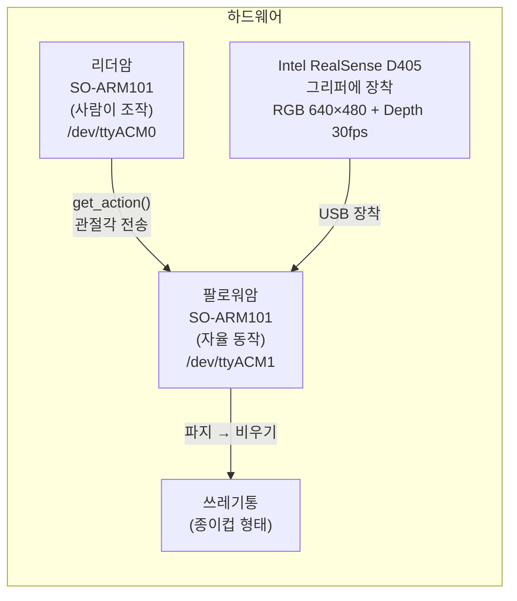

**SO-ARM101 관절 구성 (5DOF + 그리퍼)**

| 관절 이름 | 모터 ID | 역할 | 범위 |
|----------|---------|------|------|
| `shoulder_pan` | 1 | 베이스 좌우 회전 | ±110° |
| `shoulder_lift` | 2 | 어깨 앞뒤 회전 | ±100° |
| `elbow_flex` | 3 | 팔꿈치 굽힘/펴기 | ±97° |
| `wrist_flex` | 4 | 손목 상하 굽힘 | ±95° |
| `wrist_roll` | 5 | 손목 회전 | −157° ~ +163° |
| `gripper` | 6 | 그리퍼 개폐 | −10° ~ +100° |

### 2-2. 소프트웨어 의존 관계

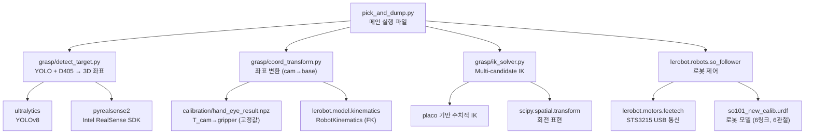

---

## 3. 프로젝트 진행 단계

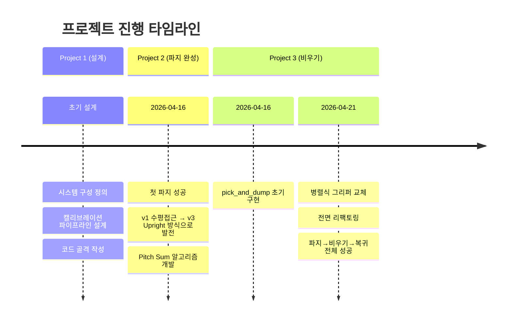

### Project 1: 기초 설계

- 시스템 구성 정의 (리더/팔로워 구조, Eye-in-Hand 방식)
- 3종 캘리브레이션 절차 설계 (관절·카메라 내부·Hand-Eye)
- 파이프라인 설계: YOLO → Depth → 좌표 변환 → IK → 파지
- 기반 코드 작성 (`detect_target.py`, `coord_transform.py`, `ik_solver.py`)

### Project 2: 파지 시스템 완성

- 파이프라인 완성 및 실제 로봇 테스트
- **2026-04-16: 첫 파지 성공** (검출 → 파지 → 들어올리기)
- 3단계 모션 시퀀스 개선 (v1 수평접근 → v2 바닥 각도조정 → **v3 Upright Preparation**)
- Pitch Sum Conservation 알고리즘 개발 (그리퍼 각도 보존)

### Project 3: 비우기 시스템 완성

- pick_and_dump.py 4-Phase 전체 파이프라인 구현
- 리더암 시연 기반 웨이포인트 방식 채택
- 병렬식 그리퍼 교체 (TCP 9.8cm → 13cm) + 재캘리브레이션
- 에러 복구 로직 추가 (IK/파지 재시도, 안전 복귀)
- **2026-04-21: 파지 → 비우기 → 제자리 돌려놓기 전체 성공**

---

## 4. 전체 소프트웨어 아키텍처

### 4-1. 전체 데이터 흐름

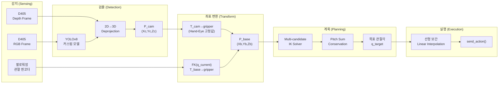

### 4-2. 파일 구조

```
project/
├── pick_and_dump/
│   ├── pick_and_dump.py       ← 메인 실행 파일 (4-Phase 전체 파이프라인)
│   └── record_demo.py         ← 리더암 웨이포인트 기록 도구
├── grasp/
│   ├── detect_target.py       ← YOLO + D405 → 3D 좌표
│   ├── coord_transform.py     ← Camera → Gripper → Base 변환
│   ├── ik_solver.py           ← Multi-candidate IK 솔버
│   └── grasp_controller.py    ← 파지 전용 컨트롤러 (Project 2)
├── calibration/
│   ├── step2_collect_handeye.py  ← Hand-Eye 데이터 수집
│   ├── step2_run_handeye.py      ← T_cam→gripper 계산
│   ├── handeye_data.npz          ← 수집된 데이터
│   └── hand_eye_result.npz       ← 캘리브레이션 결과
├── isaac_sim/
│   ├── so_arm_visualizer.py   ← Isaac Sim UDP 수신 + 가상 로봇 구동
│   ├── so_arm_test.py         ← Isaac Sim 단독 테스트
│   └── joint_streamer.py      ← 네트워크 테스트용 sin파 전송
├── so101_new_calib.urdf       ← 로봇 모델 (6링크, TCP=13cm)
├── best.pt                    ← YOLOv8 커스텀 모델
└── README.md
```

---

## 5. 핵심 알고리즘 상세

### 5-1. 물체 검출 (YOLO + Depth)

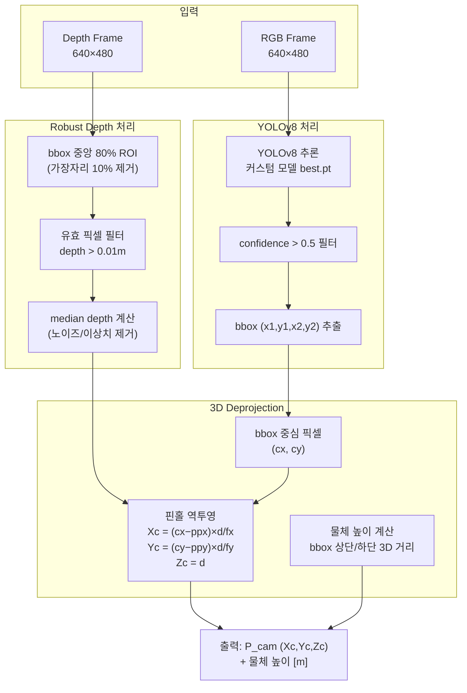

**핵심 포인트**
- **Robust Depth**: 단일 픽셀 대신 bbox 중앙 80% 영역의 median 값 → 엣지/반사/투명 재질 노이즈 제거
- **적응형 파지 높이**: 물체 높이의 70% 지점 파지 (2~10cm 범위 클램프)
- **D405 공장 캘리브레이션**: fx, fy, ppx, ppy는 RealSense SDK에서 자동 제공

---

### 5-2. 좌표 변환 파이프라인 (Eye-in-Hand)

Eye-in-Hand 구성에서 카메라 좌표를 로봇 베이스 좌표로 변환하는 2단계 과정입니다.

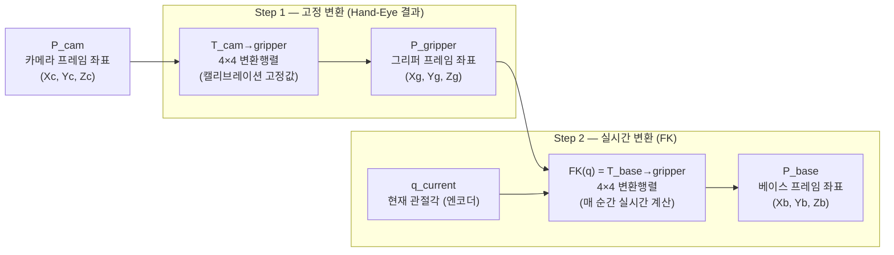

**수식**

```
P_gripper = T_cam→gripper × P_cam      ← 고정값 (캘리브레이션 결과)
P_base    = FK(q_current) × P_gripper  ← 현재 관절각으로 실시간 계산
```

> Eye-in-Hand의 핵심: 카메라가 그리퍼와 함께 움직이므로, 좌표 변환에는 반드시 **현재 관절각(FK)**이 필요합니다.

---

### 5-3. Forward Kinematics (FK)

URDF 모델의 링크-관절 체인을 따라 각 관절 변환행렬을 연쇄 곱하여 EEF(그리퍼) 위치와 자세를 계산합니다.

```
T_base→gripper = T01(q1) × T12(q2) × T23(q3) × T34(q4) × T45(q5) × T5→gripper(fixed)

입력: q = [shoulder_pan, shoulder_lift, elbow_flex, wrist_flex, wrist_roll]  [deg]
출력: 4×4 동차변환행렬 (회전 R(3×3) + 위치 t(3×1))
라이브러리: placo (lerobot 내장 RobotKinematics)
```

**사용처**
- 좌표 변환의 Step 2 (그리퍼 → 베이스 변환)
- Hand-Eye 캘리브레이션 데이터 수집 시 T_base→gripper 계산
- IK 결과 검증 (FK 역검증으로 위치 오차 계산)

---

### 5-4. Inverse Kinematics — Multi-Candidate IK

5DOF 로봇은 임의의 6DOF 자세를 달성할 수 없습니다. 국소 최적해 문제를 해결하기 위해 다중 초기값 탐색 전략을 사용합니다.

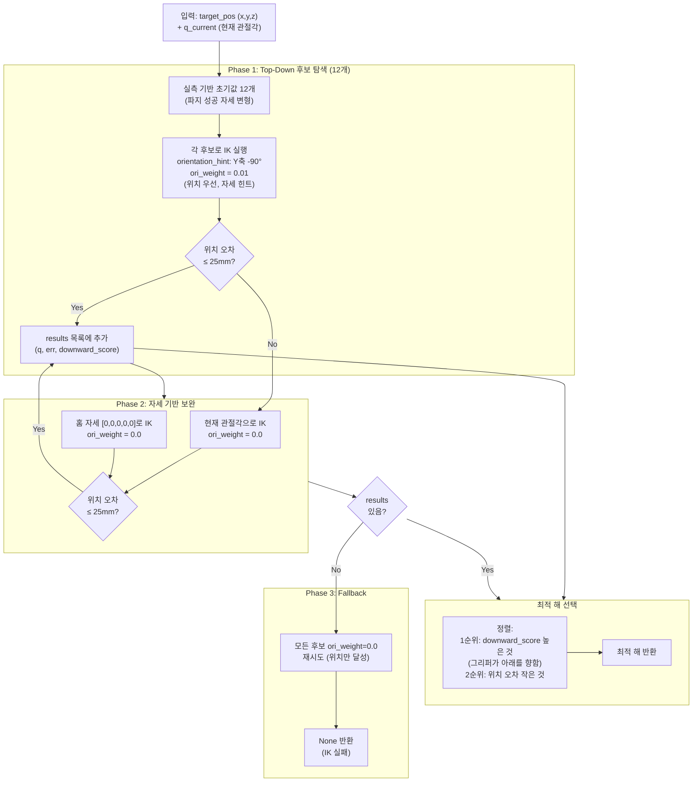

**downward_score 계산**

```python
# 그리퍼 Z축(접근 방향)이 월드 -Z 방향(아래)을 향할수록 높은 점수
T = kin.forward_kinematics(q)
gripper_z_world = T[:3, 2]          # 그리퍼 Z축의 월드 성분
downward_score = -gripper_z_world[2] # 아래를 향할수록 양수, 클수록 좋음
```

---

### 5-5. Pitch Sum Conservation (그리퍼 각도 보존)

5DOF 직렬 로봇에서 어깨~손목 3관절의 피치 합이 일정하면, 팔이 어떤 자세를 취하든 그리퍼의 절대 피치 각도가 보존됩니다.

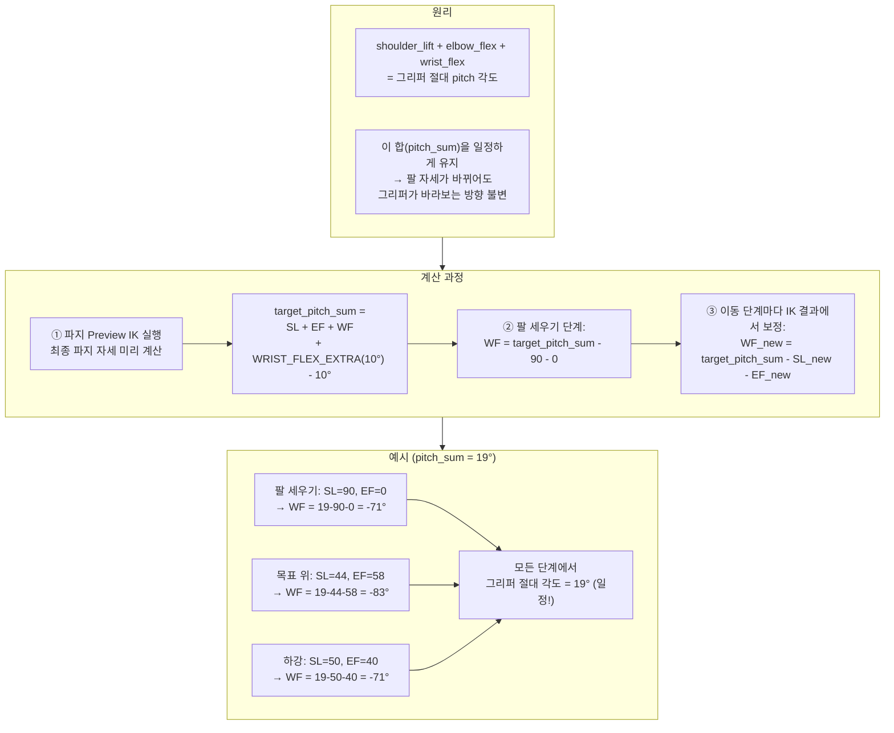

---

### 5-6. Upright Preparation (팔 세우기 접근법)

카메라(그리퍼에 장착)가 물체와 충돌하는 문제를 해결하기 위해 개발한 접근 전략입니다.

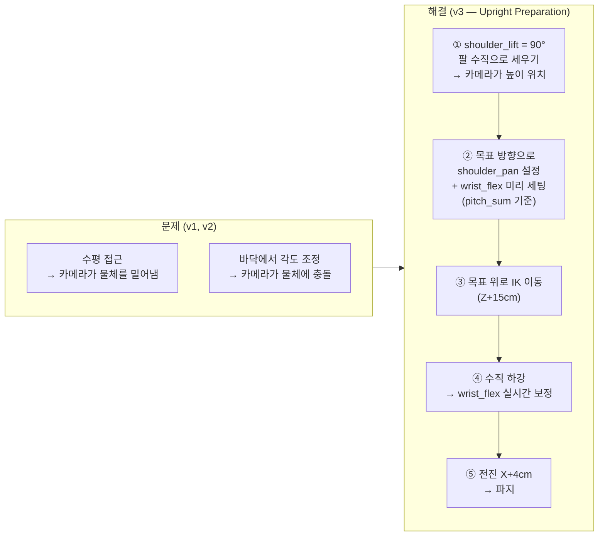

**장점**: 높은 곳에서 모든 관절 각도를 세팅하므로, 하강 전 카메라가 물체와 충분히 멀어진 상태에서 자세 조정 가능.

---

### 5-7. Gripper-Only Close (관절 고정 파지)

파지 시 그리퍼만 닫고 다른 관절은 전혀 움직이지 않도록 합니다.

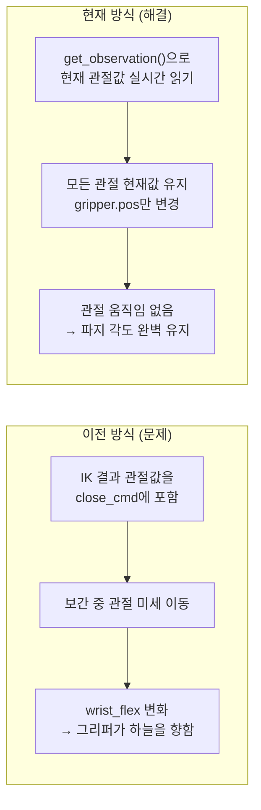

```python
obs = follower.get_observation()
close_cmd = {k: obs[k] for k in obs if ".pos" in k}
close_cmd["gripper.pos"] = GRASP_CLOSE  # 그리퍼만 닫기
```

---

### 5-8. 선형 관절 보간 (Linear Joint Interpolation)

급격한 관절 이동을 방지하여 안전하고 부드러운 동작을 구현합니다.

```
for step i = 1 to N:
    alpha = i / N
    q_cmd = q_current + alpha × (q_target - q_current)
    robot.send_action(q_cmd)
    sleep(50ms)

이동 시간 = N × 50ms
```

| 구간 | Steps | 소요 시간 |
|------|-------|----------|
| 팔 세우기 (Phase 1) | 60 | 3.0초 |
| 목표 위 접근 | 50 | 2.5초 |
| 수직 하강 | 50 | 2.5초 |
| 전진 | 40 | 2.0초 |
| 그리퍼 닫기 | 30 | 1.5초 |
| 웨이포인트 이동 (Phase 2~4) | 80 | 4.0초 |

---

## 6. 동작 시퀀스 (4 Phase)

### 전체 흐름

```mermaid
flowchart TD
    START([시작]) --> INIT["초기화\n로봇 연결 + 카메라 시작\n+ SAFE_POSE 이동"]
    INIT --> P1

    subgraph P1["Phase 1: 검출 + 파지 (~14.6초)"]
        direction TB
        P1_1["텔레오퍼레이션 +\nYOLO 실시간 검출"] --> P1_2{"DETECTED\n+ ENTER?"}
        P1_2 -- Yes --> P1_3["좌표 변환\ncam → base"]
        P1_3 --> P1_4["① 팔 세우기\nSL=90°, 60steps"]
        P1_4 --> P1_5["② 목표 위 접근\nZ+15cm, 50steps"]
        P1_5 --> P1_6["③ 수직 하강\nZ=파지높이, 50steps"]
        P1_6 --> P1_7["④ 전진\nX+4cm, 40steps"]
        P1_7 --> P1_8["⑤ 그리퍼 닫기\n관절 고정, 30steps"]
        P1_8 --> P1_9["파지 자세 저장\nq_grasp_pose"]
    end

    P1 --> P2

    subgraph P2["Phase 2: 웨이포인트 이동 (~11초)"]
        direction TB
        P2_1["WP1: 들어올리기\n팔 접어서 위로, 80steps"] --> P2_2["WP2: 우측 85° 회전\n비울 위치, 80steps"]
        P2_2 --> P2_3["도착 대기\n1.0초"]
    end

    P2 --> P3

    subgraph P3["Phase 3: 쓰레기 비우기 (~4.3초)"]
        direction TB
        P3_1["wrist_roll -160° 회전\n쓰레기통 뒤집기, 30steps"] --> P3_2["낙하 대기\n1.0초"]
        P3_2 --> P3_3["wrist_roll 원복\n원래 각도로, 30steps"]
    end

    P3 --> P4

    subgraph P4["Phase 4: 역순 복귀 + 내려놓기 (~16초)"]
        direction TB
        P4_1["WP2 복귀, 80steps"] --> P4_2["WP1 복귀, 80steps"]
        P4_2 --> P4_3["내려놓기\nq_grasp_pose 재사용\n80steps"]
        P4_3 --> P4_4["그리퍼 열기\n관절 고정, 20steps"]
    end

    P4 --> SAFE["SAFE_POSE 복귀"]
    SAFE --> DONE([완료])

    style P1 fill:#e8f5e9
    style P2 fill:#e3f2fd
    style P3 fill:#fff3e0
    style P4 fill:#fce4ec
```

**전체 소요 시간**: 약 **46초** (검출 대기 시간 제외)

### 웨이포인트 (2026-04-21 실측)

```python
DUMP_WAYPOINTS = [
    # WP1: 파지 후 들어올리기 (팔 접어서 위로)
    {"shoulder_pan": -9.89, "shoulder_lift": -28.48, "elbow_flex": -64.48,
     "wrist_flex": 88.0, "wrist_roll": 0.66},

    # WP2: 베이스 우측 회전 (비울 위치, shoulder_pan=85°)
    {"shoulder_pan": 85.05, "shoulder_lift": -17.27, "elbow_flex": -52.70,
     "wrist_flex": 70.07, "wrist_roll": 3.0},
]
```

---

## 7. 캘리브레이션 체계

```mermaid
flowchart TD
    CAL_OVERVIEW["캘리브레이션 3종"]

    subgraph CAL1["① 관절 캘리브레이션 (최초 1회 + 하드웨어 변경 시)"]
        C1_1["Feetech STS3215\nraw 값 0~4095 (12-bit)"]
        C1_2["homing_offset 기록\n(로봇 0° 기준점 설정)"]
        C1_3["range_min / range_max 기록\n(물리적 회전 범위)"]
        C1_4["저장: ~/.cache/huggingface/lerobot/\ncalibration/robots/so_follower/None.json"]
        C1_1 --> C1_2 --> C1_3 --> C1_4
    end

    subgraph CAL2["② 카메라 내부 캘리브레이션 (불필요)"]
        C2_1["D405 공장 캘리브레이션 내장\n(fx, fy, ppx, ppy)"]
        C2_2["RealSense SDK에서 자동 제공\n별도 작업 불필요"]
        C2_1 --> C2_2
    end

    subgraph CAL3["③ Hand-Eye 캘리브레이션 (카메라 위치 변경 시 재실행)"]
        C3_1["ChArUco 보드 바닥 고정\n5×7, DICT_6X6_250\nsquare=30mm, marker=22mm"]
        C3_2["리더암으로 팔로워암을 조작\n15+ 자세에서 데이터 수집"]
        C3_3["각 자세에서:\nR_gripper2base (FK로 계산)\nR_target2cam (solvePnP로 계산)"]
        C3_4["cv2.calibrateHandEye()\nmethod=TSAI\nAX=XB 풀이"]
        C3_5["저장: calibration/hand_eye_result.npz\nT_cam→gripper (4×4 행렬)"]
        C3_1 --> C3_2 --> C3_3 --> C3_4 --> C3_5
    end

    CAL_OVERVIEW --> CAL1
    CAL_OVERVIEW --> CAL2
    CAL_OVERVIEW --> CAL3
```

**Hand-Eye 캘리브레이션 수학적 원리 (AX=XB)**

```
A_i = T_gripper2base(pose_j)^(-1) × T_gripper2base(pose_i)   ← 로봇 그리퍼 이동 (FK)
B_i = T_target2cam(pose_i) × T_target2cam(pose_j)^(-1)       ← 카메라 보드 관측 변화
X   = T_cam→gripper                                            ← 구하는 값 (고정 변환)

A × X = X × B
```

---

## 8. 에러 복구 체계

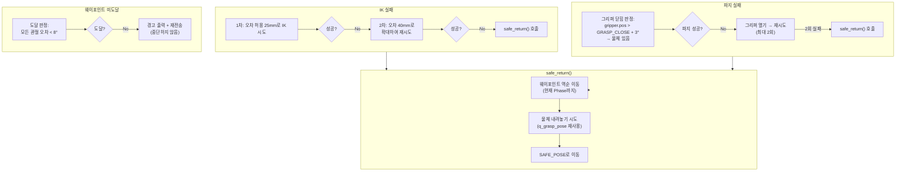

---

## 9. Isaac Sim 실시간 미러링

Ubuntu의 실제 로봇이 움직이면, Windows의 Isaac Sim 가상 로봇이 실시간으로 동일하게 미러링됩니다.

### 9-1. 구현 상태

| 항목 | 상태 |
|------|------|
| Isaac Sim 가상환경 구축 | ✅ 완료 |
| 링크별 STL 메시 로드 | ✅ 완료 |
| 관절 DriveAPI 연결 | ✅ 완료 |
| 단독 테스트 (`so_arm_test.py`) | ✅ 완료 |
| Ubuntu → Windows UDP 스트리밍 | ✅ 완료 |
| `pick_and_dump.py` 통합 | ✅ 완료 |
| **실제 로봇 연결 후 미러링 테스트** | 🔲 미완료 |

### 9-2. 전체 아키텍처

```mermaid
flowchart LR
    subgraph UBUNTU["Ubuntu 24.04 (실제 로봇)"]
        ROBOT["SO-ARM101\n실제 로봇"]
        PICKDUMP["pick_and_dump.py\nPhase 1~4 실행"]
        STREAMER["start_isaac_streamer()\n백그라운드 daemon 스레드\nget_observation() @ 30Hz"]
        JSON_PKT["JSON 패킷\n{shoulder_pan: deg,\n shoulder_lift: deg, ...}\n~150 bytes"]
    end

    subgraph NETWORK["네트워크 192.168.0.x"]
        UDP["UDP / port 5005\n30Hz / ~150 bytes"]
    end

    subgraph WINDOWS["Windows 11 (Isaac Sim 2023.1.1)"]
        RECV["UDPReceiver\n0.0.0.0:5005\nbinding"]
        CLAMP["관절 범위 클램핑\nJOINT_LIMITS_DEG"]
        DRIVE["UsdPhysics.DriveAPI\n각 관절 SetTarget(deg)"]
        VIRT["가상 SO-ARM101\nso101_new_calib.urdf\n링크별 STL 메시\nDriveAPI 제어"]
    end

    ROBOT -- "get_observation()" --> PICKDUMP
    PICKDUMP -- "공유 인스턴스" --> STREAMER
    STREAMER --> JSON_PKT --> UDP --> RECV --> CLAMP --> DRIVE --> VIRT
```

**구현 방식**: `start_isaac_streamer(follower)`를 `follower.connect()` 직후 1줄 추가로 시작.  
daemon 스레드로 동작하므로 pick_and_dump 메인 로직에 영향 없음. 시리얼 포트 충돌 없음.

### 9-3. 파일 구성

| 파일 | 실행 위치 | 역할 |
|------|----------|------|
| `isaac_sim/so_arm_visualizer.py` | Windows | UDP 수신 → 가상 로봇 구동 (핵심) |
| `isaac_sim/so_arm_test.py` | Windows | 로봇 없이 Isaac Sim 단독 테스트 |
| `isaac_sim/joint_streamer.py` | Ubuntu | `--no-robot` 옵션으로 네트워크 연결 테스트 |

### 9-4. Isaac Sim 핵심 기술

**URDF 임포트 패턴** (Isaac Sim 2023.1.1 공식 방식)

```python
_, cfg = omni.kit.commands.execute("URDFCreateImportConfig")
cfg.merge_fixed_joints    = False
cfg.import_inertia_tensor = True
cfg.fix_base              = True
cfg.create_physics_scene  = False
cfg.make_default_prim     = True
cfg.distance_scale        = 100   # URDF[m] → stage[cm]
# ※ cfg.default_drive_type 설정 금지 → TypeError 발생

ok, stage_path = omni.kit.commands.execute(
    "URDFParseAndImportFile",
    urdf_path=SIM_URDF,
    import_config=cfg,
    get_articulation_root=True,
)
kit.update()  # DriveAPI 프림 등록을 위해 한 프레임 처리 필수
```

**DriveAPI 관절 탐색** (전체 네임스페이스 탐색)

```python
# 로봇 최상위 네임스페이스 전체를 탐색 (base_link 하위만 하면 1개만 검출됨)
robot_ns = "/" + articulation_root.strip("/").split("/")[0]  # /so101_new_calib
for prim in stage.Traverse():
    if not str(prim.GetPath()).startswith(robot_ns + "/"):
        continue
    drive = UsdPhysics.DriveAPI.Get(prim, "angular")
    if drive:
        drive.GetStiffnessAttr().Set(1e8)
        drive.GetDampingAttr().Set(1e6)

# 매 프레임 목표각 설정 (단위: degrees)
drive.GetTargetPositionAttr().Set(target_deg)
```

### 9-5. 3D 모델 구성

**URDF**: `SO-ARM100/Simulation/SO101/so101_new_calib.urdf` (onshape-to-robot 생성)

| STL 파일 | URDF 링크 | 설명 |
|----------|----------|------|
| `base_so101_v2.stl` | `base_link` | 베이스 플레이트 |
| `rotation_pitch_so101_v1.stl` | `shoulder_link` | 숄더 회전 부품 |
| `upper_arm_so101_v1.stl` | `upper_arm_link` | 상완 |
| `under_arm_so101_v1.stl` | `lower_arm_link` | 하완 |
| `wrist_roll_pitch_so101_v2.stl` | `wrist_link` | 손목 롤/피치 |
| `moving_jaw_so101_v1.stl` | `moving_jaw_so101_v1_link` | 그리퍼 가동 조 |
| `sts3215_03a_v1.stl` | 각 링크 | Feetech STS3215 서보모터 |

### 9-6. 트러블슈팅

| 증상 | 원인 | 해결 |
|------|------|------|
| `TypeError: UrdfJointTargetType` | `cfg.default_drive_type = 1` 정수 사용 | ImportConfig에서 drive 설정 전부 제거 |
| DriveAPI 1개만 발견 | `articulation_root`(`/base_link`) 하위만 탐색 | 로봇 최상위(`/so101_new_calib/`) 전체 탐색 |
| 카메라 xformOp 오류 | 이미 존재하는 op에 `AddXformOp` 재호출 | `GetOrderedXformOps()`로 기존 op 가져온 후 `Set` 사용 |
| UDP 데이터 없음 경고 | 방화벽 차단 또는 다른 대역 | 방화벽 규칙 확인, Ubuntu·Windows 동일 공유기 연결 |
| 흰색 실린더 로봇 | 구버전 `so101_visual.urdf` 사용 | `SO-ARM100/Simulation/SO101/so101_new_calib.urdf` 사용 |

### 9-7. 네트워크 설정

| 항목 | 값 |
|------|-----|
| Windows IP | `192.168.0.47` (이더넷 어댑터) |
| UDP 포트 | `5005` |
| 전송 주파수 | `30Hz` |
| 패킷 형식 | JSON, ~150 bytes |

Ubuntu와 Windows가 **같은 공유기(192.168.0.x 대역)**에 연결되어 있어야 합니다.

---

## 10. 주요 파라미터

### 파지 파라미터

| 파라미터 | 값 | 설명 |
|---------|-----|------|
| `GRASP_OPEN` | 100.0 | 그리퍼 열림 |
| `GRASP_CLOSE` | −10.0 | 그리퍼 닫힘 (음수=더 강하게) |
| `GRASP_X_OFFSET` | 0.04 m | 전진 거리 |
| `GRASP_Y_OFFSET` | −0.01 m | 오른쪽 1cm 보정 |
| `GRASP_Z_TARGET` | 0.03 m | 기본 파지 높이 (절대값) |
| `WRIST_FLEX_EXTRA` | 10° | pitch_sum 추가 보정 |
| `MAX_REL_TARGET` | 5.0°/step | 파지 구간 최대 이동량 |

### 비우기 파라미터

| 파라미터 | 값 | 설명 |
|---------|-----|------|
| `DUMP_ROLL_ANGLE` | −160° | wrist_roll 회전량 (반대 방향) |
| `MAX_REL_TARGET` | 10.0°/step | 이동 구간 최대 이동량 |

### 에러 복구 파라미터

| 파라미터 | 값 | 설명 |
|---------|-----|------|
| `GRASP_CHECK_THRESHOLD` | 3.0° | 파지 성공 판정 기준 |
| `MAX_GRASP_RETRIES` | 2 | 파지 재시도 횟수 |
| `IK_RETRY_THRESHOLD` | 40.0 mm | IK 재시도 오차 허용 |
| `JOINT_ARRIVAL_THRESHOLD` | 8.0° | 웨이포인트 도달 판정 |

---

## 11. 개발 이력 및 문제 해결

### 주요 문제 해결 이력

| 문제 | 원인 | 해결 |
|------|------|------|
| IK 100mm+ 오차 | 5DOF로 6DOF 자세 달성 불가 | `orientation_weight=0.0` (위치 우선) + Multi-candidate 탐색 |
| 카메라가 물체 밀어냄 (v1) | 수평 접근 시 카메라 충돌 | **Upright Preparation** (팔 세우기 → 수직 하강) |
| 하강 시 wrist_flex 풀림 | IK가 매번 wrist_flex 재계산 | **Pitch Sum Conservation** 알고리즘 |
| 파지 시 그리퍼 각도 변화 | IK 결과 관절값이 미세 차이 발생 | **Gripper-Only Close** (현재값 읽어서 그리퍼만 변경) |
| 내려놓기 높이 불일치 | IK 재계산값이 파지 시와 다름 | **q_grasp_pose 저장** → 내려놓기 시 그대로 재사용 |
| 그리퍼 열림/닫힘 반대 | `GRASP_OPEN=0.0`이 실제 닫힘 | `GRASP_OPEN=100.0`, `GRASP_CLOSE=−10.0` |
| wrist_roll 캘리브레이션 문제 | range_min/max 너무 좁아 클리핑 | range 0~4095로 확대, drive_mode=1 설정 |
| DriveAPI 1개만 발견 (Isaac Sim) | base_link 하위만 탐색 | 로봇 최상위 네임스페이스(`/so101_new_calib/`) 전체 탐색 |
| TypeError: UrdfJointTargetType | ImportConfig에 drive 타입 정수 설정 | ImportConfig에서 drive 설정 제거 → DriveAPI 직접 제어 |

### 모션 시퀀스 발전 이력

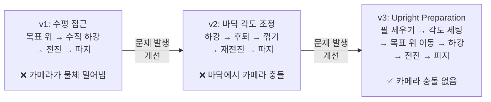

---

## 12. 실행 방법

### 메인 시스템 실행 (Ubuntu)

```bash
# 환경 설정
conda activate lerobot
cd ~/lerobot2/project

# 메인 실행
python pick_and_dump/pick_and_dump.py
```

**조작 순서**
1. 리더암으로 팔로워암을 조작하여 카메라로 쓰레기통을 비춤
2. 화면에 `DETECTED` 표시되면 **ENTER** → 자동 파지 시작
3. 파지 → 웨이포인트 이동 → 비우기 → 역순 복귀 → 내려놓기 → 홈 복귀 자동 진행
4. **q**로 종료

### 캘리브레이션

```bash
# 1. 모터 캘리브레이션 (처음 또는 하드웨어 변경 시)
lerobot-calibrate --robot.type=so101_follower --robot.port=/dev/ttyACM0
lerobot-calibrate --teleop.type=so101_leader  --teleop.port=/dev/ttyACM1

# 2. Hand-Eye 캘리브레이션 데이터 수집
python calibration/step2_collect_handeye.py

# 3. 변환행렬 계산
python calibration/step2_run_handeye.py
```

### Isaac Sim 미러링 (Windows)

```bat
:: Step 1: 방화벽 열기 (관리자 CMD, 최초 1회)
netsh advfirewall firewall add rule name="IsaacSimUDP" protocol=UDP dir=in localport=5005 action=allow

:: Step 2: Isaac Sim 실행
cd D:\isaac-sim
python.bat D:\isaac-sim\so-arm101\SO-ARM101\project\isaac_sim\so_arm_visualizer.py
```

### 설치

```bash
pip install -e ".[dev,test,feetech,intelrealsense,kinematics]"
pip install opencv-python pyrealsense2 ultralytics scipy

# Intel RealSense SDK
sudo apt install -y librealsense2-dkms librealsense2-utils librealsense2-dev
sudo apt install -y ros-jazzy-realsense2-camera
```

---
