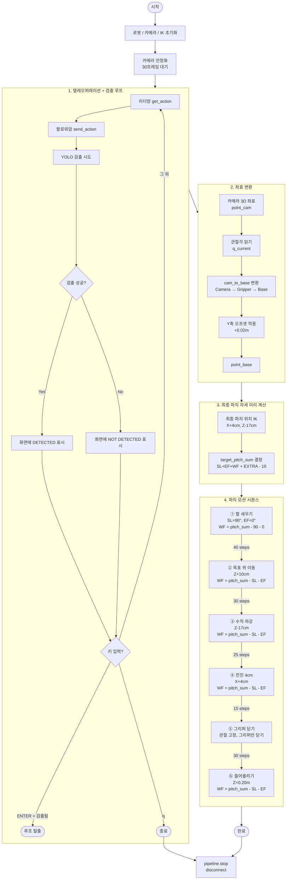
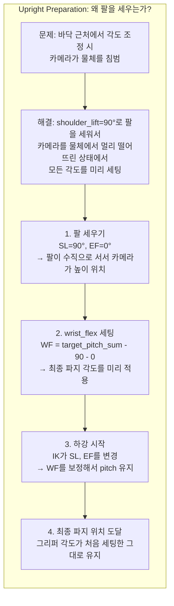
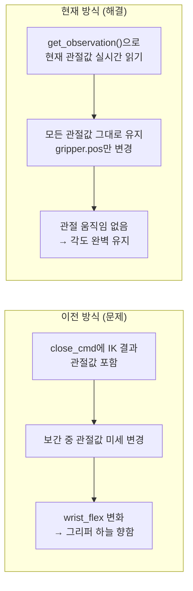
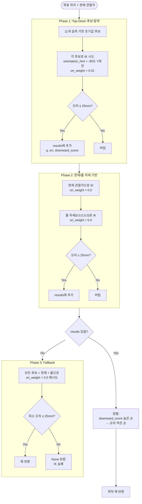
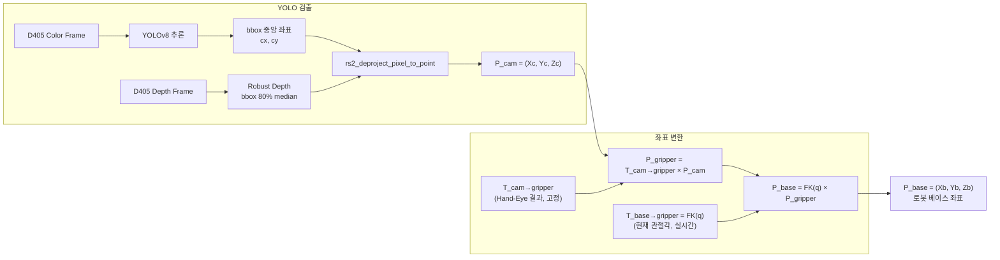
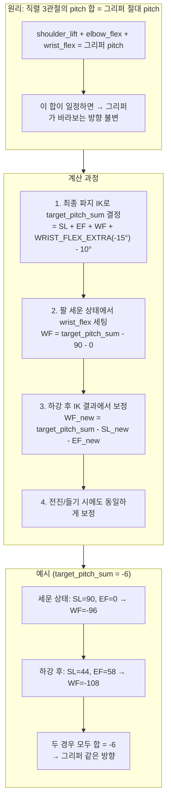
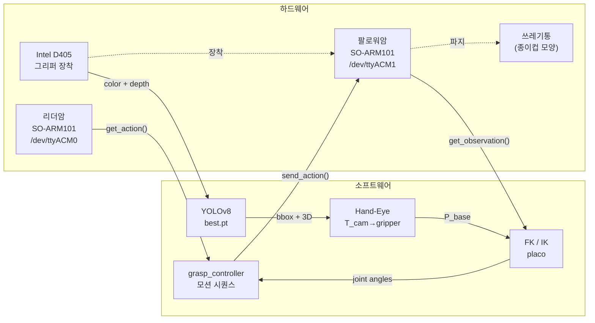

# Project 2: SO-ARM101 쓰레기통 파지 시스템 — 진행 보고서

## 1. 프로젝트 개요

SO-ARM101 5DOF 로봇암 2대(리더/팔로워)와 Intel RealSense D405 카메라를 사용하여,
커스텀 YOLO 모델로 종이컵 모양 쓰레기통을 검출하고 자동으로 파지하는 **Classical 방식** 시스템.

| 항목 | 내용 |
|------|------|
| 로봇 | SO-ARM101 x 2 (리더 ACM0 / 팔로워 ACM1) |
| 카메라 | Intel RealSense D405 (eye-in-hand, 그리퍼 장착) |
| 검출 | YOLOv8 커스텀 모델 (`best.pt`) |
| 운동학 | placo 기반 FK/IK (lerobot v0.5.2 내장) |
| 캘리브레이션 | ChArUco 보드 + OpenCV Hand-Eye (TSAI) |
| OS | Ubuntu 24.04, Python 3.12+ |

---

## 2. 현재 작업 단계

### 현재: 모션 시퀀스 최적화 (파지 성공률 향상)

지금 하고 있는 작업은 **로봇이 물체를 안정적으로 파지하기 위한 모션 시퀀스 최적화**입니다.

검출 → 좌표 변환 → IK까지의 파이프라인은 완성되었고, 실제 로봇이 물체를 잡으러 이동할 때
**카메라 충돌 방지**, **그리퍼 각도 유지**, **파지 힘 조절** 등의 실전 문제를 해결하는 중입니다.

**2026-04-16: 첫 파지 성공!** — 쓰레기통 검출 → 파지 → 들어올리기 → 내려놓기 성공

### 다음 단계

| 순서 | 작업 | 설명 |
|------|------|------|
| ~~완료~~ | ~~모션 시퀀스 최적화~~ | ~~팔 세우기→각도 세팅→하강→파지 흐름 튜닝~~ |
| **현재** | 다양한 위치 테스트 | 쓰레기통 위치를 바꿔가며 파지 성공률 측정 |
| 다음 1 | 물체 놓기(Place) | 파지 후 지정 위치에 놓는 동작 추가 |
| 다음 2 | 에러 복구 | IK 실패, 파지 실패 시 재시도 로직 |
| 다음 3 | 자동화 | 사람 개입 없이 검출→파지→놓기 전체 자동화 |
| 다음 4 | (선택) 학습 기반 | Classical 결과를 시드로 강화학습/모방학습 적용 |

---

## 3. 완료된 작업

### 3-1. 환경 구축
- [x] lerobot v0.5.2 설치 (`pip install -e ".[feetech,intelrealsense,kinematics]"`)
- [x] 관절 캘리브레이션 (기존 `~/.cache/huggingface/lerobot/calibration/` 활용)
- [x] URDF 정리: STL 메시 제거 (FK/IK 전용), D405 카메라 마운트 추가
- [x] D405 카메라 연결 확인 (640x480, 30fps, color+depth)

### 3-2. Hand-Eye Calibration
- [x] ChArUco 보드 생성 (`calibration/generate_charuco.py`) — 5x7, DICT_6X6_250
- [x] 보드 크기 실측 반영: square=30mm, marker=22mm
- [x] 데이터 수집 (`calibration/step2_collect_handeye.py`) — 15개+ 자세
- [x] T_cam→gripper 계산 (`calibration/step2_run_handeye.py`) — cv2.calibrateHandEye (TSAI)
- [x] 결과 저장: `calibration/hand_eye_result.npz`

### 3-3. 객체 검출
- [x] YOLO 검출 모듈 (`grasp/detect_target.py`)
- [x] Robust depth 계산 (bbox 중앙 80% 영역 median)
- [x] 실시간 검출 테스트 (`grasp/test_detection.py`) — 검출 정상 확인

### 3-4. 좌표 변환
- [x] Camera → Gripper → Base 변환 파이프라인 (`grasp/coord_transform.py`)
- [x] Hand-Eye 결과 lazy loading

### 3-5. IK 솔버
- [x] Multi-candidate IK 솔버 (`grasp/ik_solver.py`)
- [x] 실측 파지 자세 기반 초기값 후보 11개
- [x] Top-down 자세 선호 정렬 (downward_score)
- [x] Fallback: 자세 무시, 위치만 달성

### 3-6. 파지 컨트롤러
- [x] 텔레오퍼레이션 + 실시간 검출 루프 (`grasp/grasp_controller.py`)
- [x] Pitch sum 보존 알고리즘 (하강 시 그리퍼 각도 유지)
- [x] 선형 보간 이동 (`move_joints_smooth`)
- [x] 들어올리기 동작
- [x] **Upright Preparation 방식** (v3): 팔 세우기→각도 세팅→하강→파지
- [x] **그리퍼 닫기 시 관절 고정**: 현재 관절값을 읽어서 그리퍼만 변경

### 3-7. 해결한 주요 문제들

| 문제 | 원인 | 해결 |
|------|------|------|
| STL 메시 로드 실패 | placo가 URDF의 visual/collision 로드 시도 | URDF에서 visual/collision 블록 제거 |
| IK 100mm+ 오차 | 5DOF로 6DOF 자세 달성 불가 | orientation_weight=0.0 (위치 우선) |
| IK fallback 항상 None | threshold 체크 누락 | fallback 섹션에 threshold 체크 추가 |
| 그리퍼 열림/닫힘 반대 | GRASP_OPEN=0.0이 실제로 닫힘 | GRASP_OPEN=100.0, GRASP_CLOSE=0.0 |
| 카메라가 물체 밀기 (v1) | 수평 이동 시 카메라가 물체 충돌 | 수직 하강 접근 방식으로 변경 |
| 하강 시 wrist_flex 풀림 | IK가 매번 wrist_flex 재계산 | pitch sum 보존 알고리즘 적용 |
| wrist_flex 꺾기 시 물체 충돌 (v2) | 바닥에서 꺾으면 카메라가 물체 침범 | 2cm 후퇴 → 꺾기 → 재전진 |
| 카메라가 물체 밀기 (v2) | 바닥에서 각도 조정 시 카메라 충돌 | **Upright Preparation 방식 (v3)**: 팔을 세워서 각도 미리 세팅 |
| 파지 시 wrist_flex 변경 | 그리퍼 닫기 명령에 관절값 포함 | 현재 관절값을 읽어서 그리퍼만 닫기 |
| 파지 힘 부족 | GRASP_CLOSE=0.0이 최소 닫힘 | GRASP_CLOSE=-10.0으로 강화 |
| 파지 위치 Y축 편차 | GRASP_Y_OFFSET=0.03 (왼쪽 3cm) | GRASP_Y_OFFSET=0.02로 1cm 우측 보정 |
| 하강 IK 실패 (14cm 위에서 파지) | GRASP_Z_LOWER 상대값이 음수 좌표 생성 | **GRASP_Z_TARGET=0.03 절대 높이**로 변경 |

---

## 4. 현재 파라미터

```python
GRASP_OPEN = 100.0       # 그리퍼 열림 (0~100)
GRASP_CLOSE = -10.0      # 그리퍼 닫힘 (음수=더 강하게)
GRASP_Y_OFFSET = 0.02    # Y축 왼쪽 오프셋 [m]
GRASP_X_OFFSET = 0.04    # X축 전진 오프셋 [m]
WRIST_FLEX_EXTRA = -15    # wrist_flex 추가 보정 [deg] (음수=위로)
GRASP_Z_TARGET = 0.03    # 파지 시 목표 Z 높이 [m] (베이스 기준 절대값)
MAX_REL_TARGET = 5.0     # 한 스텝 최대 이동량 [deg]
```

실측 파지 자세:
```
v3 (성공): shoulder_pan=-11, shoulder_lift=3, elbow_flex=18, wrist_flex=-8, wrist_roll=0
v1 (이전): shoulder_pan=-13, shoulder_lift=44, elbow_flex=58, wrist_flex=-83, wrist_roll=0
```

---

## 5. 모션 시퀀스 변경 이력

### v1: 수평 접근
```
목표 위(+10cm) → 수직 하강 → 전진 → 파지
```
**문제**: 카메라가 물체를 밀어냄

### v2: 바닥에서 각도 조정
```
목표 위(+10cm) → 수직 하강 → 전진 → 후퇴(2cm) → wrist_flex 꺾기 → 재전진 → 파지
```
**문제**: 바닥에서 wrist_flex 꺾을 때 카메라가 물체 충돌

### v3 (현재): Upright Preparation 방식
```
팔 세우기(SL=90°) → 각도 미리 세팅 → 목표 위 이동 → 수직 하강 → 전진 → 파지
```
**장점**: 높은 곳에서 모든 각도를 세팅하므로 카메라 충돌 없음

---

## 6. 파일 구조

```
project/
├── so101_new_calib.urdf          # 로봇 URDF (FK/IK 전용, D405 마운트 포함)
├── best.pt                       # YOLO 커스텀 모델 (쓰레기통 검출)
├── project1.md                   # 초기 설계 문서
├── project2.md                   # 진행 보고서 (이 문서)
├── calibration/
│   ├── generate_charuco.py       # ChArUco 보드 이미지 생성
│   ├── step2_collect_handeye.py  # Hand-Eye 캘리브레이션 데이터 수집
│   ├── step2_run_handeye.py      # T_cam→gripper 계산
│   ├── handeye_data.npz          # 수집된 캘리브레이션 데이터
│   └── hand_eye_result.npz       # 캘리브레이션 결과 (T_cam→gripper)
└── grasp/
    ├── detect_target.py          # YOLO + D405 → 3D 좌표 검출
    ├── coord_transform.py        # Camera → Gripper → Base 좌표 변환
    ├── ik_solver.py              # Multi-candidate IK 솔버
    ├── grasp_controller.py       # 메인 파지 컨트롤러
    └── test_detection.py         # YOLO 검출 테스트 (독립 실행)
```

---

## 7. grasp_controller.py 블록도

### 7-1. 전체 흐름 (v3: Upright Preparation)



### 7-2. Upright Preparation 상세 (v3 핵심)



### 7-3. 그리퍼 닫기 시 관절 고정



### 7-4. IK 솔버 상세 흐름



### 7-5. 좌표 변환 파이프라인



### 7-6. Pitch Sum Conservation 상세



---

## 8. 사용된 알고리즘

### 8-1. Forward Kinematics (FK)

관절각 → EEF 위치/자세 변환. URDF의 DH 파라미터를 기반으로 각 관절의 변환행렬을 연쇄 곱합니다.

```
T_base→eef = T_01(q1) × T_12(q2) × T_23(q3) × T_34(q4) × T_45(q5) × T_5→gripper(fixed)
```

- **라이브러리**: placo (lerobot 내장 `RobotKinematics`)
- **입력**: 관절각 5개 [deg]
- **출력**: 4x4 동차변환행렬 (위치 + 회전)
- **사용처**: 좌표 변환 (그리퍼→베이스), IK 결과 검증

### 8-2. Inverse Kinematics (IK)

목표 EEF 위치 → 관절각 역산. placo의 수치적 IK를 사용하며, 5DOF 제약으로 인해 위치만 우선합니다.

```
minimize  ||FK(q)_pos - target_pos||² × w_pos + ||FK(q)_rot - target_rot||² × w_ori
subject to  joint_limits
```

- **라이브러리**: placo (수치적 IK, damped least squares 계열)
- **위치 가중치**: 1.0 (항상)
- **자세 가중치**: 0.01 (top-down 힌트 시) / 0.0 (위치 우선)
- **특징**: 5DOF로 6DOF 자세 달성 불가 → `orientation_weight` 를 최소화

### 8-3. Multi-Candidate IK Strategy

5DOF IK는 국소 최적해에 빠지기 쉬우므로, 11개 실측 기반 초기값 후보에서 병렬 탐색합니다.

```
후보 선정 기준:
  1) 실측 파지 자세 [-13, 44, 58, -83, 0] 및 변형
  2) 현재 관절각
  3) 홈 자세 [0, 0, 0, 0, 0]

해 선택 기준 (prefer_topdown=True):
  1차: downward_score 높은 것 (그리퍼가 아래를 향할수록 좋음)
  2차: 위치 오차 적은 것

downward_score = -gripper_z[2]  (그리퍼 Z축의 월드 Z성분, 양수일수록 아래)
```

### 8-4. Hand-Eye Calibration (AX=XB)

Eye-in-hand 구성에서 카메라-그리퍼 간 고정 변환(T_cam→gripper)을 구합니다.

```
A_i × X = X × B_i

A_i = T_gripper2base(pose_i)^(-1) × T_gripper2base(pose_j)   (로봇 움직임)
B_i = T_target2cam(pose_i) × T_target2cam(pose_j)^(-1)       (보드 관측 변화)
X   = T_cam→gripper                                            (구하는 값)
```

- **방법**: Tsai-Lenz (cv2.CALIB_HAND_EYE_TSAI)
- **보드**: ChArUco 5x7 (DICT_6X6_250, square=30mm, marker=22mm)
- **데이터**: 15개+ 다양한 자세에서 수집
- **보드 검출**: `cv2.aruco.CharucoDetector` + `cv2.solvePnP`

### 8-5. Pitch Sum Conservation (그리퍼 각도 유지)

5DOF 직렬 로봇에서 shoulder_lift, elbow_flex, wrist_flex 3개 관절의 합이 일정하면 그리퍼의 절대 pitch 각도가 보존됩니다.

```
pitch_sum = shoulder_lift + elbow_flex + wrist_flex = constant

target_pitch_sum 결정:
  IK로 최종 파지 자세 미리 계산 → SL + EF + WF + WRIST_FLEX_EXTRA(-15°) - 10°

모든 이동 단계에서:
  wrist_flex_new = target_pitch_sum - shoulder_lift_new - elbow_flex_new
```

- **목적**: 하강/전진/들어올리기 시 그리퍼가 바닥을 향한 각도를 일정하게 유지
- **보정 타이밍**: IK 결과를 받은 직후, wrist_flex만 덮어쓰기
- **적용 범위**: 팔 세우기, 목표 위 이동, 하강, 전진, 들어올리기 — **전 구간**

### 8-6. Upright Preparation (팔 세우기 접근)

카메라 충돌을 원천 차단하기 위해, 팔을 수직으로 세운 상태에서 모든 관절 각도를 세팅합니다.

```
1. shoulder_lift = 90° (팔 수직)
2. elbow_flex = 0° (팔꿈치 펴기)
3. wrist_flex = target_pitch_sum - 90 - 0 (최종 파지 각도 미리 세팅)
4. shoulder_pan = IK 결과의 방향 (목표 XY 방향)
5. wrist_roll = 0° (중립)
```

- **목적**: 카메라가 물체와 먼 상태에서 안전하게 각도 세팅
- **이전 방식 대비**: 바닥에서 후퇴→꺾기→재전진 불필요

### 8-7. Gripper-Only Close (관절 고정 파지)

파지 시 그리퍼만 닫고 다른 관절은 변경하지 않습니다.

```python
obs = follower.get_observation()               # 현재 관절값 실시간 읽기
close_cmd = {k: obs[k] for k in obs if ".pos" in k}  # 모든 관절 현재값 유지
close_cmd["gripper.pos"] = GRASP_CLOSE          # 그리퍼만 닫기
```

- **목적**: 파지 시 wrist_flex 등이 변경되어 그리퍼 방향이 바뀌는 문제 방지
- **이전 방식**: IK 결과의 관절값을 close_cmd에 포함 → 미세한 차이로 관절 이동 발생

### 8-8. Linear Joint Interpolation (부드러운 이동)

급격한 관절 이동을 방지하기 위해 현재→목표를 선형 보간합니다.

```
for step i = 1 to N:
    alpha = i / N
    q_cmd = q_current + alpha × (q_target - q_current)
    robot.send_action(q_cmd)
    sleep(50ms)
```

- **이동 시간**: steps × 50ms (예: 30 steps = 1.5초)
- **구간별 steps**: 팔 세우기 40, 접근 30, 하강 25, 전진 15, 파지 30, 들기 20

### 8-9. Robust Depth Estimation

D405 depth 센서의 노이즈와 경계 불연속을 제거합니다.

```
1. bbox의 중앙 80% 영역만 사용 (가장자리 10% 제거)
2. depth > 0.01m인 유효 픽셀만 선택
3. 유효 픽셀의 median 값 반환
```

- **목적**: 물체 경계의 depth 불연속, 0값(미검출), 배경 혼입 방지

### 8-10. 3D Deprojection

2D 픽셀 좌표 + depth → 카메라 프레임 3D 좌표 변환.

```
X_cam = (cx - ppx) × depth / fx
Y_cam = (cy - ppy) × depth / fy
Z_cam = depth
```

- **함수**: `rs.rs2_deproject_pixel_to_point(intrinsics, [cx, cy], depth)`
- **intrinsics**: D405 공장 캘리브레이션 (fx, fy, ppx, ppy)

---

## 9. 시스템 연결도


