# Project 3: 쓰레기통 비우기 (Pick and Dump)

## 1. 개요

Project 2에서 완성한 파지 기능을 확장하여, 쓰레기통을 **파지 → 비울 위치로 이동 → wrist_roll 회전으로 비우기 → 제자리에 내려놓기**하는 전체 작업을 수행합니다.

### 핵심 차이점 (vs Project 2)
- **비우기 방식**: 그리퍼를 열어서 떨어뜨리는 것이 아니라, **wrist_roll을 160도 회전**시켜 쓰레기통을 뒤집어 비움
- **비울 위치 지정**: 리더암을 원하는 위치로 옮기고 ENTER → 그 관절값을 비울 위치로 사용
- **제자리 복귀**: 비운 후 원래 파지 위치로 돌아가 쓰레기통을 내려놓음

---

## 2. 전체 흐름

```mermaid
flowchart TD
    START([시작]) --> INIT[로봇 / 카메라 / IK 초기화]
    INIT --> P1

    subgraph P1 ["Phase 1: 검출 + 파지"]
        direction TB
        P1_1[텔레오퍼레이션 + YOLO 검출] --> P1_2{ENTER?}
        P1_2 -- Yes --> P1_3[좌표 변환]
        P1_3 --> P1_4[팔 세우기 SL=90°]
        P1_4 --> P1_5[목표 위 접근]
        P1_5 --> P1_6[수직 하강]
        P1_6 --> P1_7[전진]
        P1_7 --> P1_8[그리퍼 닫기<br/>관절 고정]
        P1_8 --> P1_9[들어올리기<br/>Z=0.20m]
    end

    P1 --> P2

    subgraph P2 ["Phase 2: 비울 위치 지정"]
        direction TB
        P2_1["팔로워: 물체 잡고 대기<br/>(텔레오퍼레이션 중지)"]
        P2_1 --> P2_2["리더암을 비울 위치로 이동<br/>(사용자 조작)"]
        P2_2 --> P2_3{ENTER?}
        P2_3 --> P2_4[리더암 관절값 읽기<br/>= 비울 위치]
    end

    P2 --> P3

    subgraph P3 ["Phase 3: 비울 위치로 이동"]
        direction TB
        P3_1["팔로워를 리더암 관절값으로<br/>선형 보간 이동 (40 steps)"]
    end

    P3 --> P4

    subgraph P4 ["Phase 4: 쓰레기 비우기"]
        direction TB
        P4_1["wrist_roll +160° 회전<br/>(30 steps)"] --> P4_2["1초 대기<br/>(쓰레기 낙하)"]
        P4_2 --> P4_3["wrist_roll 원복<br/>(30 steps)"]
    end

    P4 --> P5

    subgraph P5 ["Phase 5: 제자리 복귀 + 내려놓기"]
        direction TB
        P5_1[들어올린 높이로 복귀] --> P5_2["하강 (GRASP_Z_TARGET)"]
        P5_2 --> P5_3["그리퍼 열기<br/>관절 고정"]
        P5_3 --> P5_4[위로 빠져나가기]
    end

    P5 --> DONE([완료])
```



---

## 3. 파일 구조

```
project/
├── grasp/                        # Project 2 (파지만) — 기존 코드 유지
│   ├── grasp_controller.py
│   ├── detect_target.py
│   ├── coord_transform.py
│   ├── ik_solver.py
│   └── test_detection.py
├── pick_and_dump/                # Project 3 (파지 + 비우기 + 내려놓기)
│   └── pick_and_dump.py
├── project1.md
├── project2.md
└── project3.md                   # 이 문서
```

### 모듈 의존 관계

```
pick_and_dump.py (실행)
  ├── import grasp/detect_target    → YOLO 검출
  ├── import grasp/coord_transform  → 좌표 변환 (cam→base)
  └── import grasp/ik_solver        → IK 계산
```

`pick_and_dump.py`는 `grasp/` 폴더의 모듈을 import해서 사용합니다.

---

## 4. 사용법

```bash
cd ~/lerobot2/project
python pick_and_dump/pick_and_dump.py
```

### 조작 순서

1. 리더암으로 팔로워암을 조작해서 카메라로 쓰레기통을 비춤
2. 화면에 DETECTED 표시되면 **ENTER** → 자동 파지 + 들어올리기
3. 팔로워는 물체를 잡고 대기 → **리더암을 비울 위치로 이동**
4. **ENTER** → 팔로워가 비울 위치로 이동 → wrist_roll 회전 → 비우기
5. 자동으로 원래 위치에 쓰레기통 내려놓기

---

## 5. 설정 파라미터

```python
# 파지 관련 (Project 2와 동일)
GRASP_OPEN = 100.0
GRASP_CLOSE = -10.0
GRASP_Y_OFFSET = 0.02
GRASP_X_OFFSET = 0.04
WRIST_FLEX_EXTRA = -15
GRASP_Z_TARGET = 0.03

# 비우기 관련 (신규)
DUMP_ROLL_ANGLE = 160.0   # wrist_roll 회전량 [deg]
```

---

## 6. 주요 알고리즘

### 6-1. 비울 위치 지정 (리더암 관절값 복사)

파지 후 텔레오퍼레이션을 중지하고, 리더암만 자유롭게 움직여서 비울 위치를 지정합니다.
ENTER를 누르면 리더암의 현재 관절값을 읽어서 팔로워의 목표로 사용합니다.

```python
leader_obs = leader.get_action()
q_dump_target = [leader_obs[f"{j}.pos"] for j in JOINT_NAMES]
# → 팔로워가 이 관절값으로 이동
```

### 6-2. wrist_roll 비우기

다른 관절은 고정한 채 wrist_roll만 회전시켜 쓰레기통을 뒤집습니다.

```python
obs = follower.get_observation()
dump_cmd = {k: obs[k] for k in obs if ".pos" in k}   # 모든 관절 현재값 유지
dump_cmd["wrist_roll.pos"] += DUMP_ROLL_ANGLE          # wrist_roll만 회전
```

- 회전 후 1초 대기 (쓰레기 낙하)
- 이후 wrist_roll을 비우기 전 값으로 원복

### 6-3. 제자리 복귀 + 내려놓기

파지 직후 기억해둔 관절값(`q_grasp_origin`)으로 복귀한 뒤,
원래 파지 위치로 하강 → 그리퍼 열기 → 위로 빠져나가기.

---

## 7. 진행 상태

- [x] pick_and_dump.py 코드 작성
- [ ] 실제 로봇 테스트
- [ ] DUMP_ROLL_ANGLE 튜닝 (160도 적절한지 확인)
- [ ] 비울 위치 이동 시 충돌 방지 검토
- [ ] 다양한 위치에서 테스트
- [ ] 에러 복구 로직 추가
- [ ] 전체 자동화 (ENTER 없이 반복)
