# Project 3: 쓰레기통 비우기 (Pick and Dump)

## 1. 개요

Project 2에서 완성한 파지 기능을 확장하여, 쓰레기통을 **파지 → 웨이포인트 기반 이동 → wrist_roll 회전으로 비우기 → 역순 복귀 → 제자리에 내려놓기**하는 전체 작업을 수행합니다.

### 핵심 차이점 (vs Project 2)
- **비우기 방식**: 그리퍼를 열어서 떨어뜨리는 것이 아니라, **wrist_roll을 160도 회전**시켜 쓰레기통을 뒤집어 비움
- **웨이포인트 기반 이동**: 리더암으로 시연한 3개 웨이포인트를 순서대로 따라 이동
- **제자리 복귀**: 비운 후 웨이포인트 역순으로 복귀하여 파지 자세로 내려놓음

---

## 2. 전체 흐름

```mermaid
flowchart TD
    START([시작]) --> INIT[로봇 / 카메라 / IK 초기화]
    INIT --> P1

    subgraph P1 ["Phase 1: 검출 + 파지"]
        direction TB
        P1_1[텔레오퍼레이션 + YOLO 검출] --> P1_2{ENTER?}
        P1_2 -- Yes --> P1_3[좌표 변환 cam→base]
        P1_3 --> P1_4["팔 세우기 SL=90°<br/>(40 steps, 2.5초)"]
        P1_4 --> P1_5["목표 위 접근 Z+10cm<br/>(30 steps, 1.8초)"]
        P1_5 --> P1_6["수직 하강 Z=0.03m<br/>(25 steps, 1.55초)"]
        P1_6 --> P1_7["전진 X+4cm<br/>(15 steps, 1.05초)"]
        P1_7 --> P1_8["그리퍼 닫기 관절 고정<br/>(30 steps, 2.0초)"]
        P1_8 --> P1_9[파지 자세 저장<br/>q_grasp_pose]
    end

    P1 --> P2

    subgraph P2 ["Phase 2: 웨이포인트 이동 (비울 위치까지)"]
        direction TB
        P2_1["WP1: 들어올리기 elbow 펴기<br/>(80 steps, 7.0초)"]
        P2_1 --> P2_2["WP2: 팔 접어서 높이 올림<br/>(80 steps, 7.0초)"]
        P2_2 --> P2_3["WP3: 베이스 우측 92° 회전<br/>(80 steps, 5.0초)"]
        P2_3 --> P2_4["도착 대기 1.0초"]
    end

    P2 --> P3

    subgraph P3 ["Phase 3: 쓰레기 비우기"]
        direction TB
        P3_1["wrist_roll +160° 회전<br/>(30 steps, 2.5초)"] --> P3_2["쓰레기 낙하 대기 1초"]
        P3_2 --> P3_3["wrist_roll 원복<br/>(30 steps, 2.0초)"]
    end

    P3 --> P4

    subgraph P4 ["Phase 4: 역순 복귀 + 내려놓기"]
        direction TB
        P4_1["WP3→WP2→WP1 역순 이동<br/>(각 80 steps, 5.0초)"]
        P4_1 --> P4_2["파지 자세로 하강<br/>q_grasp_pose 재사용<br/>(80 steps, 5.0초)"]
        P4_2 --> P4_3["그리퍼 열기 관절 고정<br/>(20 steps, 1.0초)"]
    end

    P4 --> DONE([완료])
```



---

## 3. 파일 구조

```
project/
├── grasp/                        # Project 2 (파지만) — 기존 코드 유지
│   ├── grasp_controller.py
│   ├── detect_target.py
│   ├── coord_transform.py
│   ├── ik_solver.py
│   └── test_detection.py
├── pick_and_dump/                # Project 3 (파지 + 비우기 + 내려놓기)
│   ├── pick_and_dump.py          # 메인 실행 파일
│   └── record_demo.py            # 리더암 웨이포인트 기록 도구
├── project1.md
├── project2.md
└── project3.md                   # 이 문서
```

### 모듈 의존 관계

```
pick_and_dump.py (실행)
  ├── import grasp/detect_target    → YOLO 검출
  ├── import grasp/coord_transform  → 좌표 변환 (cam→base)
  └── import grasp/ik_solver        → IK 계산
```

`pick_and_dump.py`는 `grasp/` 폴더의 모듈을 import해서 사용합니다.

---

## 4. 사용법

```bash
cd ~/lerobot2/project
python pick_and_dump/pick_and_dump.py
```

### 조작 순서

1. 리더암으로 팔로워암을 조작해서 카메라로 쓰레기통을 비춤
2. 화면에 DETECTED 표시되면 **ENTER** → 자동 파지
3. 파지 완료 후 자동으로 웨이포인트 3개를 따라 비울 위치로 이동
4. wrist_roll 160° 회전으로 쓰레기 비우기
5. 역순으로 원래 위치 복귀 → 파지 자세로 내려놓기 → 그리퍼 열기

### 웨이포인트 기록 도구

```bash
python pick_and_dump/record_demo.py
```

리더암을 잡고 원하는 동작을 수행하면서 ENTER로 웨이포인트를 저장합니다.
저장된 값은 코드에 붙여넣기 쉬운 형태로 출력됩니다.

---

## 5. 설정 파라미터

```python
# 파지 관련 (Project 2와 동일)
GRASP_OPEN = 100.0        # 그리퍼 열기 값
GRASP_CLOSE = -10.0       # 그리퍼 닫기 값
GRASP_Y_OFFSET = 0.02     # Y축 오프셋 (오른쪽 보정)
GRASP_X_OFFSET = 0.04     # X축 오프셋 (전진 보정)
WRIST_FLEX_EXTRA = -15    # wrist_flex 추가 꺾기
GRASP_Z_TARGET = 0.03     # 파지 높이 (절대값, m)
MAX_REL_TARGET = 5.0      # 1 step 최대 관절 이동량 [deg]

# 비우기 관련
DUMP_ROLL_ANGLE = 160.0   # wrist_roll 회전량 [deg]
```

---

## 6. 시연 기반 웨이포인트 (2026-04-16 실측)

리더암으로 시연한 동작을 3개 웨이포인트로 기록하여 사용합니다.

```python
DUMP_WAYPOINTS = [
    # WP1: 파지 후 들어올리기 (elbow 펴서 팔을 위로)
    {"shoulder_pan": -7.34, "shoulder_lift": -4.18, "elbow_flex": 50.0,
     "wrist_flex": 4.31, "wrist_roll": 1.54},

    # WP2: 높이 올린 자세 (팔 접어서 위로, elbow=-53°)
    {"shoulder_pan": -7.08, "shoulder_lift": -15.43, "elbow_flex": -53.14,
     "wrist_flex": 77.45, "wrist_roll": 1.63},

    # WP3: 베이스 우측 회전 (비울 위치, shoulder_pan=85°)
    {"shoulder_pan": 85.05, "shoulder_lift": -17.27, "elbow_flex": -52.70,
     "wrist_flex": 70.07, "wrist_roll": 1.80},
]
```

### 웨이포인트 설계 의도

| WP | shoulder_pan | shoulder_lift | elbow_flex | 역할 |
|----|-------------|--------------|-----------|------|
| 1 | -7.34° | -4.18° | **50.0°** | 팔을 펴서 쓰레기통을 충분히 들어올림 |
| 2 | -7.08° | -15.43° | **-53.14°** | 팔을 접어 높이를 확보 (충돌 방지) |
| 3 | **85.05°** | -17.27° | -52.70° | 베이스 우측 92° 회전 (비울 위치) |

---

## 7. 타이밍 상세

`move_joints_smooth`는 선형 보간으로 이동하며, **1 step = 0.05초(50ms)** 입니다.

### Phase 1: 검출 + 파지

| 동작 | steps | 보간 시간 | 대기 | 합계 |
|------|-------|----------|------|------|
| 팔 세우기 (SL=90°) | 40 | 2.0초 | 0.5초 | **2.5초** |
| 목표 위 접근 (Z+10cm) | 30 | 1.5초 | 0.3초 | **1.8초** |
| 수직 하강 (Z=0.03m) | 25 | 1.25초 | 0.3초 | **1.55초** |
| 전진 (X+4cm) | 15 | 0.75초 | 0.3초 | **1.05초** |
| 그리퍼 닫기 | 30 | 1.5초 | 0.5초 | **2.0초** |
| **Phase 1 소계** | | | | **~8.9초** |

### Phase 2: 웨이포인트 이동 (비울 위치까지)

| 동작 | steps | 보간 시간 | 대기 | 합계 |
|------|-------|----------|------|------|
| WP1: 들어올리기 | 80 | 4.0초 | 3.0초 | **7.0초** |
| WP2: 높이 올림 | 80 | 4.0초 | 3.0초 | **7.0초** |
| WP3: 베이스 우측 회전 | 80 | 4.0초 | 1.0초 | **5.0초** |
| 도착 대기 | - | - | 1.0초 | **1.0초** |
| **Phase 2 소계** | | | | **~20.0초** |

### Phase 3: 쓰레기 비우기

| 동작 | steps | 보간 시간 | 대기 | 합계 |
|------|-------|----------|------|------|
| wrist_roll +160° | 30 | 1.5초 | 1.0초 | **2.5초** |
| wrist_roll 원복 | 30 | 1.5초 | 0.5초 | **2.0초** |
| **Phase 3 소계** | | | | **~4.5초** |

### Phase 4: 역순 복귀 + 내려놓기

| 동작 | steps | 보간 시간 | 대기 | 합계 |
|------|-------|----------|------|------|
| WP3 복귀 | 80 | 4.0초 | 1.0초 | **5.0초** |
| WP2 복귀 | 80 | 4.0초 | 1.0초 | **5.0초** |
| WP1 복귀 | 80 | 4.0초 | 1.0초 | **5.0초** |
| 내려놓기 (파지 자세 재현) | 80 | 4.0초 | 1.0초 | **5.0초** |
| 그리퍼 열기 | 20 | 1.0초 | 0초 | **1.0초** |
| **Phase 4 소계** | | | | **~21.0초** |

### 전체 소요 시간: **~54.4초** (검출 대기 시간 제외)

---

## 8. 주요 알고리즘

### 8-1. Upright Preparation (팔 세우기, v3)

파지 전 shoulder_lift=90°로 팔을 세운 상태에서 pitch_sum을 맞추고 하강합니다.
이렇게 하면 카메라가 쓰레기통과 충돌하지 않습니다.

```python
q_upright[SL] = 90.0
q_upright[EF] = 0.0
q_upright[WF] = target_pitch_sum - q_upright[SL] - q_upright[EF]
```

### 8-2. Pitch Sum Conservation (그리퍼 각도 보존)

하강 중 elbow_flex가 변해도 그리퍼 각도가 유지되도록 합니다:

```
shoulder_lift + elbow_flex + wrist_flex = 상수 (target_pitch_sum)
```

매 IK 해 계산 후 `wrist_flex`를 재계산하여 pitch_sum을 유지합니다.

### 8-3. 관절 고정 그리퍼 제어

그리퍼를 열거나 닫을 때 다른 관절이 움직이지 않도록, 현재 관절값을 읽어서 gripper.pos만 변경합니다:

```python
obs = follower.get_observation()
cmd = {k: obs[k] for k in obs if ".pos" in k}
cmd["gripper.pos"] = GRASP_CLOSE  # 관절은 그대로, 그리퍼만 변경
```

### 8-4. 파지 자세 저장 → 내려놓기 재현

파지 직후 실제 관절값을 `q_grasp_pose`로 저장합니다.
내려놓기 시 IK를 다시 계산하지 않고 저장된 관절값을 그대로 사용하여 **파지 높이와 동일한 높이**에서 내려놓습니다.

```python
# 파지 직후 저장
obs_grasp = follower.get_observation()
q_grasp_pose = {k: obs_grasp[k] for k in obs_grasp if ".pos" in k}

# Phase 4에서 재사용
place_cmd = dict(q_grasp_pose)
place_cmd["gripper.pos"] = GRASP_CLOSE
move_joints_smooth(follower, place_cmd, steps=80)
```

### 8-5. 웨이포인트 기반 이동

시연한 웨이포인트를 순서대로 따라가고, 비운 후 역순으로 복귀합니다.
WP1, WP2(들어올리기)는 대기 시간 3초, WP3(베이스 회전)은 1초로 차등 적용합니다.

### 8-6. wrist_roll 비우기

다른 관절은 고정한 채 wrist_roll만 +160° 회전시켜 쓰레기통을 뒤집습니다:

```python
obs = follower.get_observation()
dump_cmd = {k: obs[k] for k in obs if ".pos" in k}
dump_cmd["wrist_roll.pos"] += DUMP_ROLL_ANGLE  # wrist_roll만 회전
```

---

## 9. 개발 이력 (2026-04-16)

### 초기 구현
- `pick_and_dump.py` 작성: Phase 1~4 전체 파이프라인 구현
- `record_demo.py` 작성: 리더암으로 웨이포인트 기록 도구
- grasp/ 폴더의 모듈(detect_target, coord_transform, ik_solver)을 import하여 재사용

### 문제 해결 과정

1. **Phase 2 ENTER 입력 불가**: `cv2.waitKey`는 OpenCV 윈도우가 없으면 동작하지 않음 → `input()`으로 변경
2. **비울 위치가 제자리**: 초기 DUMP_POSITION 값(SP=-1.19)이 파지 위치와 너무 가까움 → 리더암 시연 기반 웨이포인트 방식으로 전환
3. **비우기 전에 wrist_roll 회전 시작**: WP2→WP3(92° 베이스 회전)을 30 steps로 하면 도착 전에 Phase 3 시작 → 모든 웨이포인트를 80 steps로 통일
4. **WP1 들어올리기 부족**: elbow_flex=9.19°로 거의 편 상태 → 50.0°로 증가하여 충분히 들어올림
5. **WP1, WP2 대기 시간 부족**: 들어올리는 동작에 안정화 시간 필요 → 대기 시간을 1초 → 3초로 증가
6. **내려놓기 높이 불일치**: IK로 재계산한 관절값이 파지 시와 달라 높이가 맞지 않음 → 파지 직후 관절값을 저장(`q_grasp_pose`)하여 내려놓기 시 그대로 재사용

---

## 10. 진행 상태

- [x] pick_and_dump.py 코드 작성
- [x] record_demo.py 웨이포인트 기록 도구 작성
- [x] 리더암 시연 기반 웨이포인트 3개 기록 및 적용
- [x] 실제 로봇 테스트 — 파지 → 비우기 → 제자리 놓기 성공
- [x] DUMP_ROLL_ANGLE 160도 확인 (정상 작동)
- [x] 웨이포인트 이동 타이밍 최적화 (80 steps + 차등 대기)
- [x] 내려놓기 높이 문제 해결 (파지 자세 저장 방식)
- [ ] 다양한 위치에서 테스트
- [ ] 에러 복구 로직 추가
- [ ] 전체 자동화 (ENTER 없이 반복)
