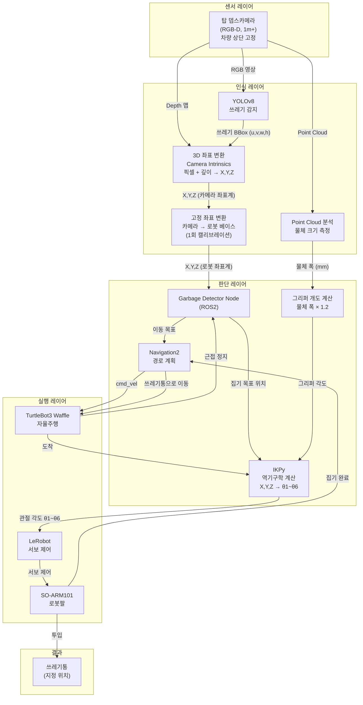
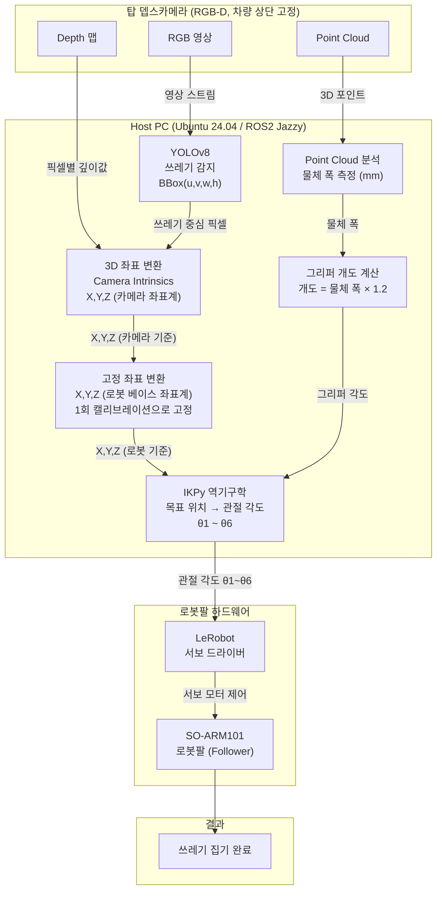
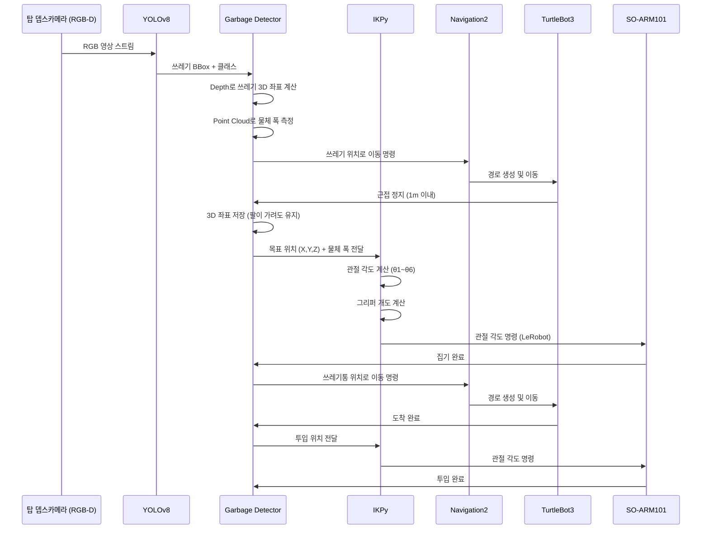
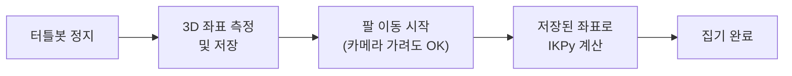

# Project B - 단일 뎁스카메라 구성

> D405 대신 1m+ 측정 가능한 뎁스카메라 1개로 단순화한 구성

---

## Project A vs Project B 비교

| 항목 | Project A (D405 손목) | Project B (1m+ 탑 고정) |
|------|----------------------|------------------------|
| 카메라 수 | 2개 (탑 RGB + 손목 D405) | **1개 (탑 RGB-D)** |
| 장착 위치 | 손목 (팔과 같이 이동) | **차량 상단 (고정)** |
| 캘리브레이션 | 핸드-아이 (복잡) | **고정 위치 1회만** |
| 근거리 정밀도 | 매우 높음 | 보통 |
| 구현 난이도 | 높음 | **낮음** |
| 추천 대상 | 정밀 파지 | **학부 캡스톤** |

---

## 전체 시스템 블럭도 (2학기 최종)

---

## 1학기 블럭도

---

## 전체 동작 흐름

---

## 핵심 포인트 - 가림 현상 해결

탑 카메라가 고정이므로 팔이 움직이면 카메라 시야를 가릴 수 있습니다.

> 터틀봇이 멈춘 직후 좌표를 한 번만 저장하면, 이후 팔이 카메라를 가려도 문제없습니다.

---

## 추천 뎁스카메라

| 카메라 | 측정 거리 | ROS2 지원 | 특징 |
|--------|----------|----------|------|
| Intel RealSense D435i | 0.3m ~ 3m | ✅ 공식 | 가장 무난 |
| Intel RealSense D455 | 0.6m ~ 6m | ✅ 공식 | 넓은 시야각 |
| OAK-D (Luxonis) | 0.2m ~ 수m | ✅ 공식 | AI 연산 내장 |

---

## 기술 스택

| 구분 | 기술 | 역할 |
|------|------|------|
| OS | Ubuntu 24.04 | 개발 환경 |
| 로봇 미들웨어 | ROS2 Jazzy | 노드 간 통신, TF 관리 |
| 자율주행 | TurtleBot3 Waffle + Navigation2 | 자율 이동 및 경로 계획 |
| 로봇팔 | SO-ARM101 (Follower) | 쓰레기 집기 실행 |
| 뎁스카메라 | RGB-D 카메라 1m+ (차량 상단) | 감지 + 3D 위치 + 크기 측정 |
| 물체 인식 | YOLOv8 | 쓰레기 감지 및 BBox 추출 |
| 팔 제어 | IKPy (역기구학) | 위치 독립적 관절 각도 계산 |
| 서보 제어 | LeRobot (feetech) | SO-ARM101 서보 드라이버 |
| 언어 | Python | - |

---

## 개발 로드맵

### 1학기 - 로봇팔 위주
- [ ] 개발 환경 구축 (ROS2 Jazzy + IKPy + LeRobot)
- [ ] SO-ARM101 캘리브레이션 및 기초 제어
- [ ] 뎁스카메라 ROS2 연동 및 고정 좌표 캘리브레이션
- [ ] YOLOv8 쓰레기 감지 + 3D 좌표 추출
- [ ] Point Cloud로 물체 크기 측정 → 그리퍼 개도 계산
- [ ] IKPy 역기구학 구현
- [ ] 통합 테스트 (감지 → IK → 집기 자율 동작)

### 2학기 - 전체 통합
- [ ] TurtleBot3 자율주행 연동
- [ ] 전체 파이프라인 통합 테스트
- [ ] 성능 최적화 및 시연
