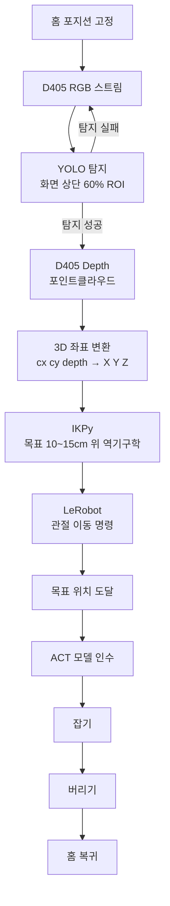
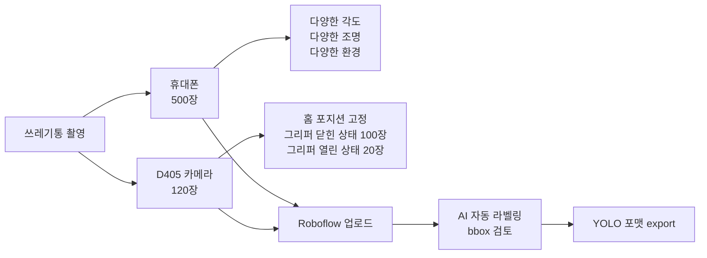
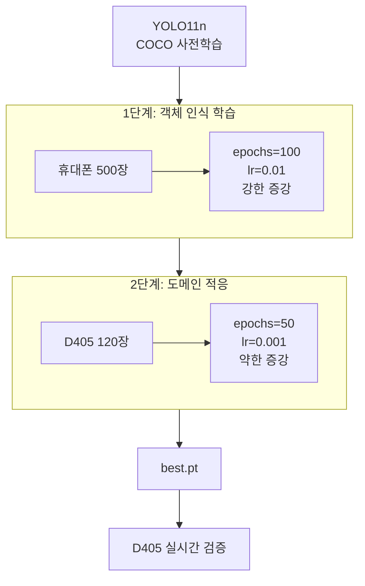
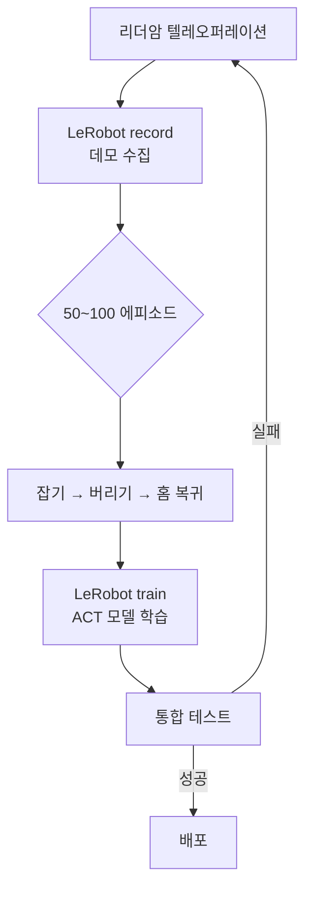
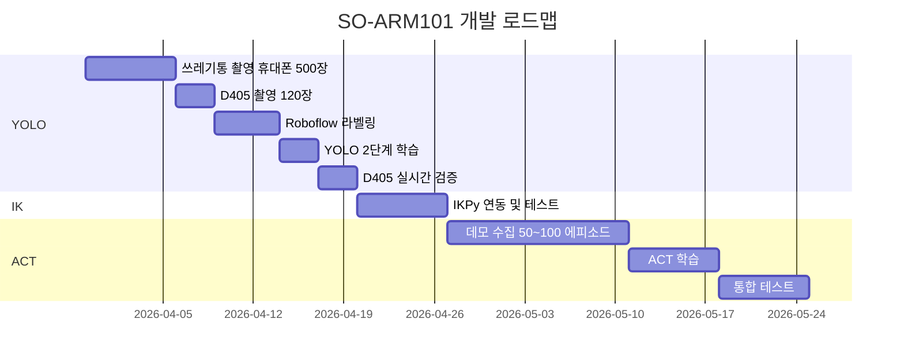

# SO-ARM101 프로젝트 계획

SO-ARM101 로봇팔로 쓰레기통을 자율적으로 인식하고 잡아서 버린 뒤 복귀하는 시스템

---

## 전체 시스템 파이프라인



---

## 1단계 — YOLO 학습

### 데이터 수집 전략



### D405 120장 세부 구성

| 조건 | 장수 |
|---|---|
| 쓰레기통 정면 | 30장 |
| 쓰레기통 좌측 | 25장 |
| 쓰레기통 우측 | 25장 |
| 쓰레기통 가까이 | 20장 |
| 쓰레기통 멀리 | 20장 |

- 홈 포지션 고정 상태에서 촬영
- 그리퍼 닫힌 상태 위주 (YOLO 실행 시점 = 그리퍼 닫힘)
- 조명 변화: 형광등 / 자연광 / 역광 최소 3가지
- 하단 40% = 그리퍼 고정 → 라벨링 불필요
- 좌우 flip 증강 금지 (그리퍼 위치 고정)

### 2단계 파인튜닝 전략



| | 1단계 휴대폰 | 2단계 D405 |
|---|---|---|
| Flip 좌우 | ✅ | ❌ |
| Rotation | ±30° | ±10° |
| Brightness | 강하게 | 약하게 |
| Mosaic | ✅ | ❌ |

### 라벨링

**Roboflow** 사용 (무료, AI 자동라벨링 + YOLO 포맷 export)

### 추론 시 ROI 마스크

```python
# 그리퍼(하단 40%) 제외, 상단 60%만 탐지
H, W = image.shape[:2]
roi = image[:int(H * 0.6), :]
results = model(roi, conf=0.5)
```

---

## 2단계 — IK 이동

- 라이브러리: `ikpy` + `so101_new_calib.urdf`
- YOLO bbox 중심 + D405 Depth → 3D 좌표 변환
- 3D 좌표 기준 10~15cm 위 목표점 → IK → 관절각도 → LeRobot 모터 명령

```python
# Depth → 3D 좌표 변환
x = (cx - intrinsics.ppx) * depth / intrinsics.fx
y = (cy - intrinsics.ppy) * depth / intrinsics.fy
z = depth
target = [x, y, z - 0.12]  # 12cm 위
```

---

## 3단계 — ACT 학습



**데모 1 에피소드 구성**
```
홈 포지션 → YOLO+IK 이동 (자동) → 리더암 조작 시작
→ 잡기 → 이동 → 버리기 → 홈 복귀 → 기록 종료
```

---

## YOLO 검증 체크리스트

| 항목 | 기준 |
|---|---|
| 탐지율 | 다양한 위치에서 안정적으로 bbox 검출 |
| 오탐지 | 그리퍼/배경 오인식 없음 |
| Depth 정확도 | bbox 중심 depth = 실제 거리 ±2cm |
| 속도 | 15fps 이상 |

### 실시간 검증 코드

```python
import pyrealsense2 as rs
import cv2
import numpy as np
from ultralytics import YOLO

model = YOLO("best.pt")

pipeline = rs.pipeline()
config = rs.config()
config.enable_stream(rs.stream.color, 848, 480, rs.format.bgr8, 30)
config.enable_stream(rs.stream.depth, 848, 480, rs.format.z16, 30)
pipeline.start(config)

while True:
    frames = pipeline.wait_for_frames()
    color_image = np.asanyarray(frames.get_color_frame().get_data())
    depth_frame = frames.get_depth_frame()

    H, W = color_image.shape[:2]
    roi = color_image[:int(H * 0.6), :]
    results = model(roi, conf=0.5)

    for box in results[0].boxes:
        x1, y1, x2, y2 = map(int, box.xyxy[0])
        cx, cy = (x1 + x2) // 2, (y1 + y2) // 2
        depth = depth_frame.get_distance(cx, cy)
        cv2.rectangle(roi, (x1, y1), (x2, y2), (0, 255, 0), 2)
        cv2.putText(roi, f"{depth:.2f}m", (x1, y1 - 10),
                    cv2.FONT_HERSHEY_SIMPLEX, 0.6, (0, 255, 0), 2)

    cv2.imshow("D405 Detection", color_image)
    if cv2.waitKey(1) == ord('q'):
        break

pipeline.stop()
```

---

## 개발 로드맵



---

## 하드웨어

| 장비 | 상태 |
|---|---|
| SO-ARM101 팔로워 | ✅ |
| SO-ARM101 리더암 | ✅ |
| Intel RealSense D405 | ✅ 그리퍼에 부착 완료 |
| URDF (IK용) | ✅ `so101_new_calib.urdf` |

## 환경 정보

- OS: Ubuntu 24.04 LTS
- ROS2: Jazzy
- Python: 3.12 (lerobot conda 환경)
- GPU: NVIDIA GeForce RTX 2080 Ti
- 로봇 포트: `/dev/ttyACM0` or `/dev/ttyACM1`
- 카메라: Intel RealSense D405 (`/dev/video2`, `/dev/video4`)
